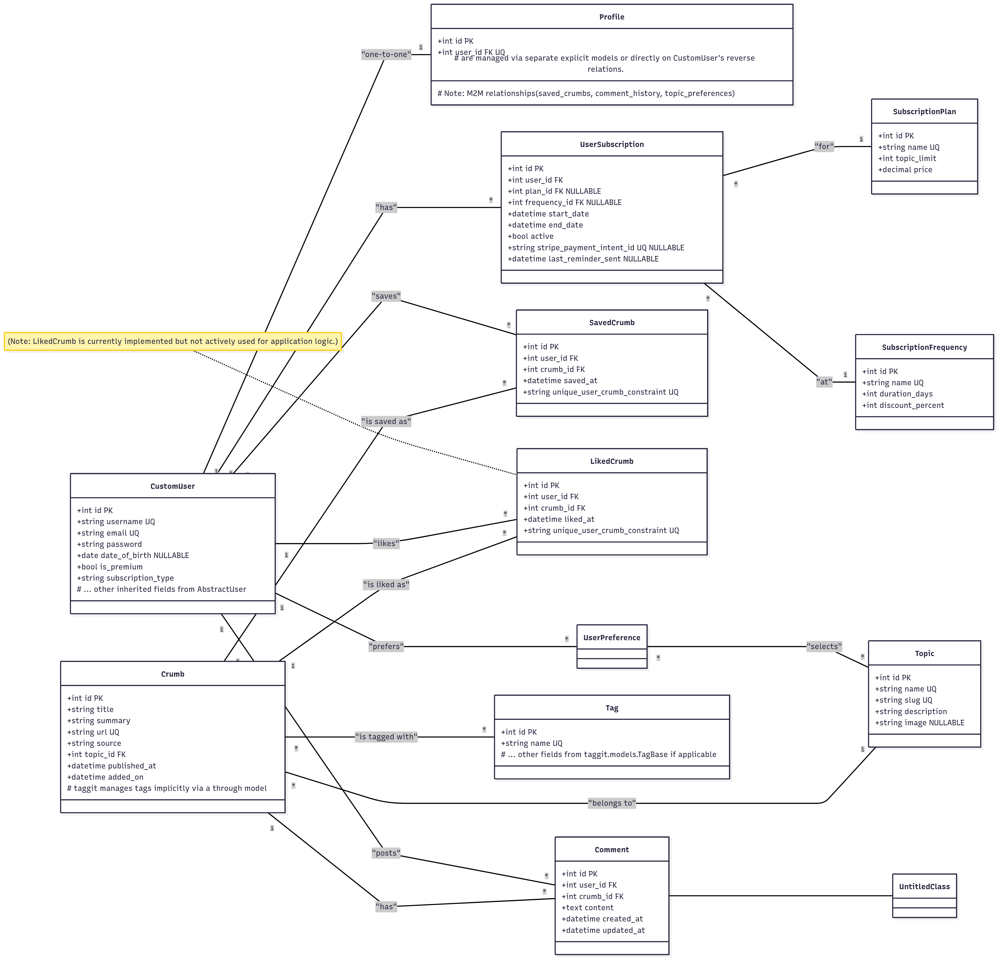

# Entity-Relationship Diagram (ERD) for InfoCrumbs
InfoCrumbs' data model is designed to manage users, content (crumbs), subscription plans, and user interactions.

---
## Key Entities:

- CustomUser: Extends Django's AbstractUser, serving as the core user authentication model. It includes fundamental user details.

- Profile: Holds additional user-specific information.

- SubscriptionPlan: Defines the different subscription tiers (e.g., Basic, Premium), including their topic limits and prices.

- SubscriptionFrequency: Specifies the billing periods for subscriptions (e.g., Weekly, Monthly, Annually), along with duration and potential discounts.

- UserSubscription: Records each user's active or historical subscriptions to specific plans and frequencies. This is the definitive source for a user's current subscription status.

- Topic: Represents content categories (e.g., Finance, Technology, Food & Drink) that users can express interest in.

- Crumb: The central content unit, representing a summarized article or insight from various sources.

- SavedCrumb: An explicit "through" model that links a CustomUser to a Crumb they have saved, capturing the saved_at timestamp.

- LikedCrumb: An explicit "through" model that links a CustomUser to a Crumb they have liked, capturing the liked_at timestamp. (Note: This model is currently implemented but not actively used for primary application logic).

- Comment: Represents user-generated comments associated with a specific Crumb.

- UserPreference: An explicit "through" model that links a CustomUser to the Topics they are interested in.

- Tag: (Implicitly from django-taggit) Represents keywords associated with Crumbs, enabling flexible content categorization.

---

## Conceptual ERD Diagram:

- ERD chart

A higher resolustion can be found [here](./‌infocrumbs-erd.svg)
---

erDiagram

    CUSTOMUSER ||--o{ PROFILE : "1:1"
    CUSTOMUSER ||--o{ USERSUBSCRIPTION : "1:Many"
    CUSTOMUSER ||--o{ USERPREFERENCE : "1:Many"
    CUSTOMUSER ||--o{ COMMENT : "1:Many"
    CUSTOMUSER ||--o{ SAVEDCRUMB : "1:Many"
    CUSTOMUSER ||--o{ LIKEDCRUMB : "1:Many"

    USERSUBSCRIPTION ||--o| SUBSCRIPTIONPLAN : "Many:1"
    USERSUBSCRIPTION ||--o| SUBSCRIPTIONFREQUENCY : "Many:1"

    USERPREFERENCE }o--o{ TOPIC : "Many:Many"

    CRUMB ||--o| TOPIC : "Many:1"
    CRUMB ||--o{ COMMENT : "1:Many"
    CRUMB ||--o{ SAVEDCRUMB : "1:Many"
    CRUMB ||--o{ LIKEDCRUMB : "1:Many"
    CRUMB }|--|| TAG : "Many:Many"

    CUSTOMUSER {
        int id PK
        string username UQ
        string email UQ
        string password
        date date_of_birth
        string is_premium
        string subscription_type
        # ... other inherited fields from AbstractUser
    }

    PROFILE {
        int id PK
        int user_id FK UQ
        # Note: M2M fields like saved_crumbs, comment_history, topic_preferences
        # are implicitly handled by their own models (SavedCrumb, Comment, UserPreference)
        # and are often not explicitly listed here to avoid redundancy.
    }

    SUBSCRIPTIONPLAN {
        int id PK
        string name UQ
        int topic_limit
        decimal price
    }

    SUBSCRIPTIONFREQUENCY {
        int id PK
        string name UQ
        int duration_days
        int discount_percent
    }

    USERSUBSCRIPTION {
        int id PK
        int user_id FK
        int plan_id FK
        int frequency_id FK
        datetime start_date
        datetime end_date
        bool active
        string stripe_payment_intent_id UQ NULLABLE
        datetime last_reminder_sent NULLABLE
    }

    TOPIC {
        int id PK
        string name UQ
        string slug UQ
        string description
        string image NULLABLE
    }

    CRUMB {
        int id PK
        string title
        string summary
        string url UQ
        string source
        int topic_id FK
        datetime published_at
        datetime added_on
        # taggit manages tags implicitly
    }

    SAVEDCRUMB {
        int id PK
        int user_id FK
        int crumb_id FK
        datetime saved_at
        string unique_user_crumb_constraint UQ
    }

    LIKEDCRUMB {
        int id PK
        int user_id FK
        int crumb_id FK
        datetime liked_at
        string unique_user_crumb_constraint UQ
    }

    COMMENT {
        int id PK
        int user_id FK
        int crumb_id FK
        text content
        datetime created_at
        datetime updated_at
    }

    TAG {
        int id PK
        string name UQ
        # Other fields from taggit.models.TagBase if applicable
    }

---
## Considerations for Future Refinement & Optimization:

- Derived User Subscription Status: The CustomUser model currently includes is_premium and subscription_type fields. These fields are redundant as the true subscription status (active plan, type, expiry) is fully captured by the UserSubscription model. It is best practice to derive is_premium and subscription_type as properties on the CustomUser model (e.g., user.is_premium() method) by querying its related UserSubscription instances. This prevents data inconsistencies.

- Profile Model Redundancy: The Profile model currently includes saved_crumbs (M2M to Crumb), comment_history (M2M to Comment), and topic_preferences (M2M to Topic). These relationships are already robustly defined by their respective explicit "through" models (SavedCrumb, Comment, UserPreference) which contain foreign keys to CustomUser. The M2M fields on Profile are redundant and can be removed. User-specific saved crumbs, comments, and topics can be accessed directly via the CustomUser model's reverse relationships (e.g., user.saved_crumbs.all(), user.comments.all(), user.userpreference.topics.all()). The Profile model's utility could then be focused solely on truly supplemental user attributes (e.g., bio, avatar URL) that don't fit directly on the CustomUser model.